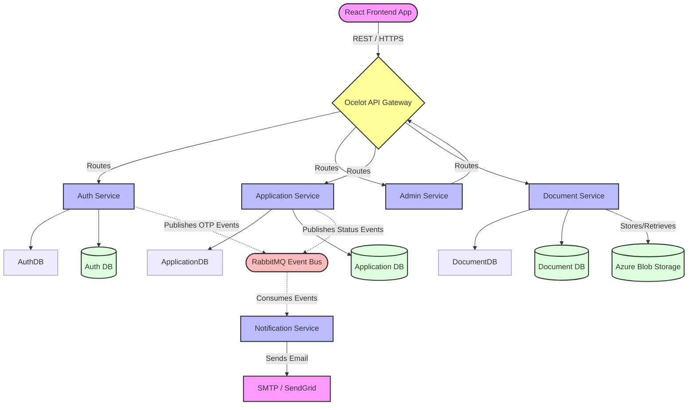
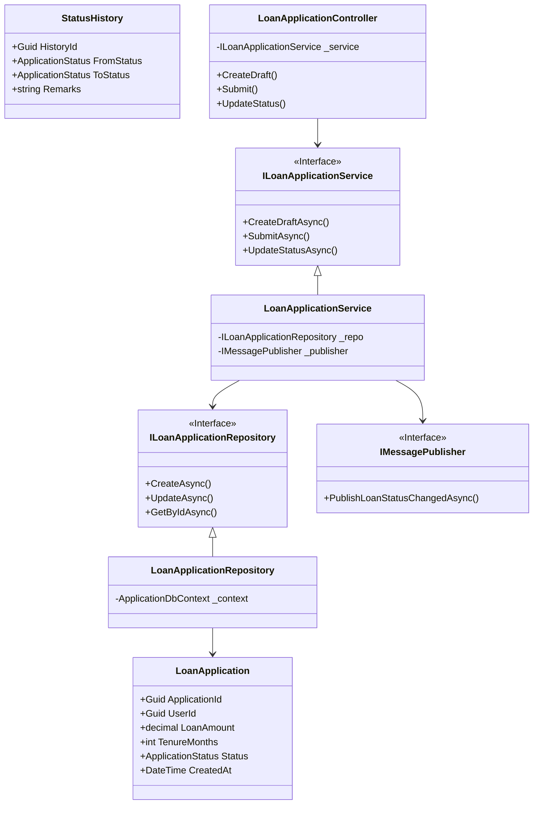
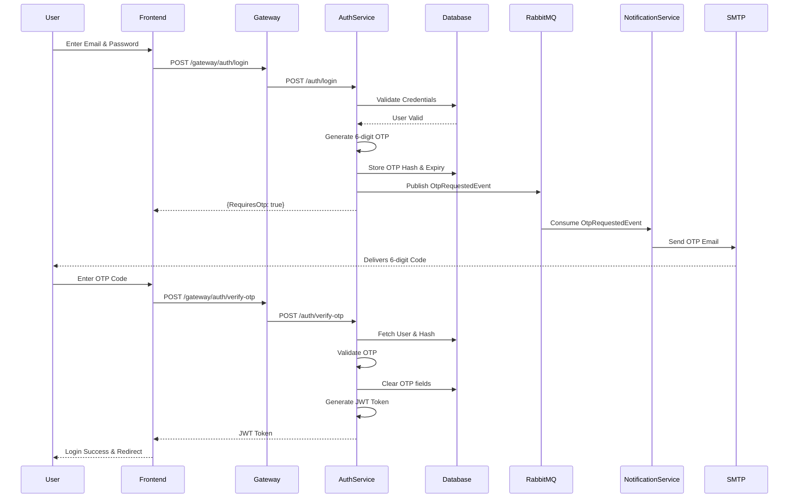

# CapFinLoan Architecture Diagrams

This document contains the High-Level Design (HLD) and Low-Level Design (LLD) diagrams for the CapFinLoan system, primarily implemented using Mermaid charts.

## High-Level Design (HLD)

The HLD illustrates the overall microservices architecture, showing how the frontend communicates with the API Gateway, which in turn routes requests to various backend services. RabbitMQ is used for asynchronous event-driven communication.

## Low-Level Design (LLD)

The LLD zooms in on the internal architecture of individual microservices. It highlights the Clean Architecture principles (Onion Architecture), showing layers such as Controllers, Services, Repositories, and the SharedKernel.

## Sequence Diagram: Multi-Factor Authentication (OTP Flow)

This sequence diagram explains the OTP-based MFA authentication mechanism introduced in Phase 2.

