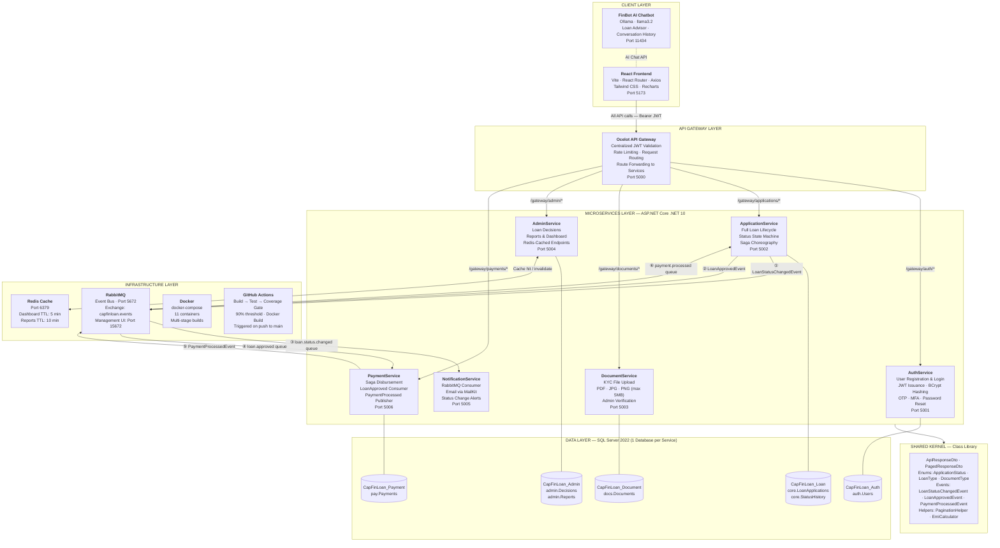
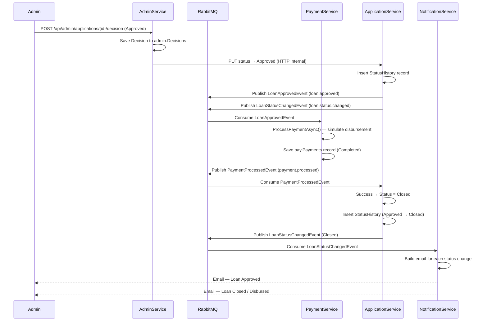
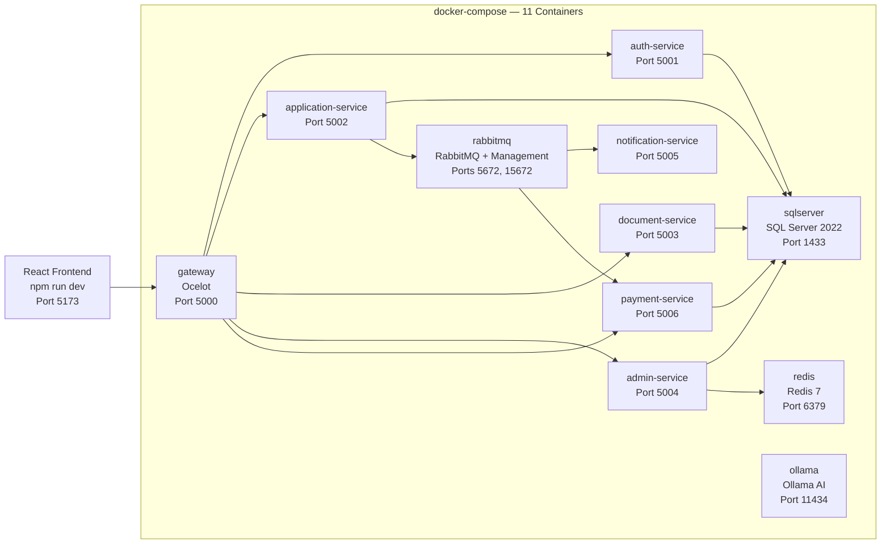

# CapFinLoan — High Level Design (HLD)

## Overview

CapFinLoan is a cloud-native, event-driven microservices application for loan onboarding and approval.
The system is composed of 6 independent backend services, an API Gateway, a React frontend, and supporting
infrastructure (RabbitMQ, Redis, SQL Server, Docker, GitHub Actions CI/CD).

---

## System Architecture Diagram

---

## Saga Choreography Flow (Loan Approval → Disbursement → Close)

---

## Component Responsibilities

| Component | Technology | Responsibility |
|---|---|---|
| React Frontend | React 18 · Vite · Tailwind · Recharts | Applicant + Admin UI. 4-step loan wizard, document upload, status tracking, admin dashboard with charts |
| FinBot AI | Ollama · llama3.2 | Conversational loan advisor chatbot. Maintains conversation history. Graceful fallback if offline |
| Ocelot Gateway | Ocelot .NET | Single entry point. JWT validation, rate limiting, route forwarding. Separate configs for local vs Docker |
| AuthService | ASP.NET Core .NET 10 | Registration, BCrypt hashing, JWT issuance, OTP generation/validation, password reset |
| ApplicationService | ASP.NET Core .NET 10 | Loan CRUD, strict status state machine, status history on every transition, Saga consumer/publisher |
| DocumentService | ASP.NET Core .NET 10 | Multipart file upload, type/size validation, stored on disk, admin verification workflow |
| AdminService | ASP.NET Core .NET 10 | Approve/reject with sanction terms, EMI calculation, reports, Redis-cached dashboard |
| NotificationService | ASP.NET Core .NET 10 | Stateless RabbitMQ consumer. Builds and sends status-specific emails via MailKit |
| PaymentService | ASP.NET Core .NET 10 | Saga step 2. Processes disbursement, publishes outcome to close or revert the loan |
| SQL Server | SQL Server 2022 | One database per service. EF Core Code-First migrations. Schema isolation (auth/core/docs/admin/pay) |
| RabbitMQ | RabbitMQ 3.x | Direct exchange `capfinloan.events`. Durable queues. Manual ack. Dead-letter on failure |
| Redis | Redis 7 | In-memory cache on AdminService. Dashboard stats (5 min TTL), report data (10 min TTL) |
| Docker | Docker Compose | All 11 services containerized. Health checks on SQL Server, RabbitMQ, Redis |
| GitHub Actions | CI/CD | Build → Test → 90% coverage gate → Docker build on every push to main |

---

## Security Architecture

| Concern | Implementation |
|---|---|
| Password storage | BCrypt hash — never stored plain |
| Authentication | JWT Bearer tokens — HmacSha256, 60 min expiry |
| Authorization | Role-based — `[Authorize]` for Applicant, `[Authorize(Roles="Admin")]` for Admin |
| UserId source | Always from JWT claims — never from request body |
| Gateway enforcement | Ocelot validates JWT centrally — services also validate independently for Swagger testing |
| TC12 | `GET /gateway/admin/*` with Applicant token → 403 Forbidden |
| Secrets | Connection strings in appsettings.json / Docker .env — never hardcoded |

---

## Deployment Architecture (Docker)

