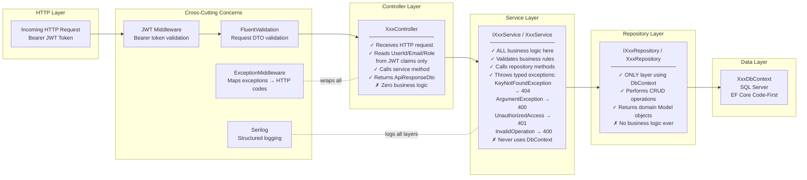
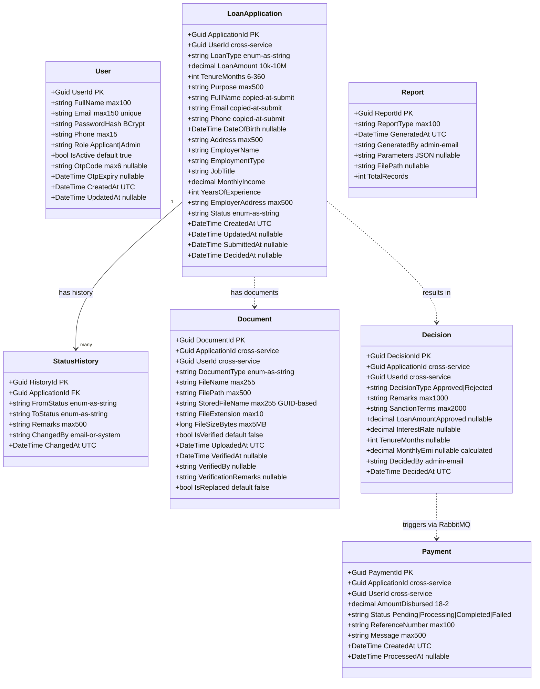
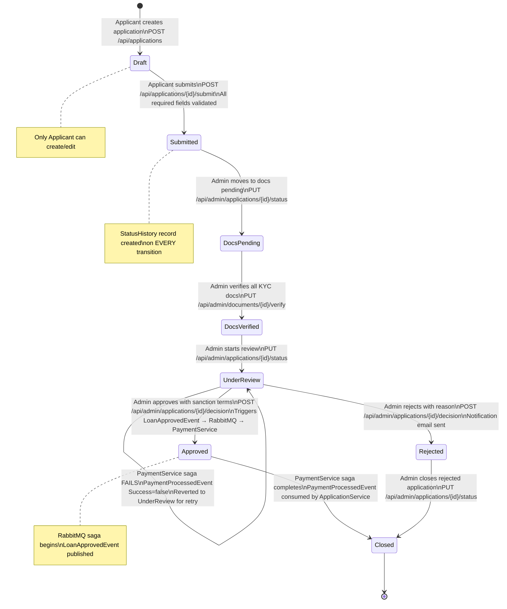
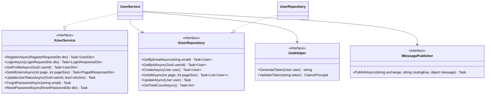
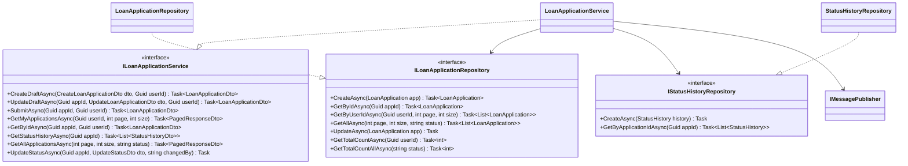
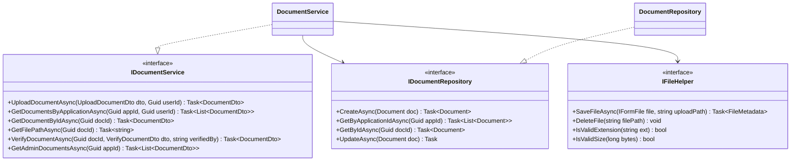
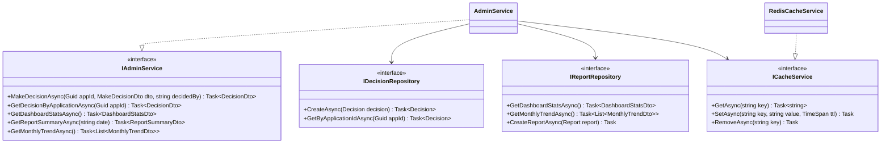
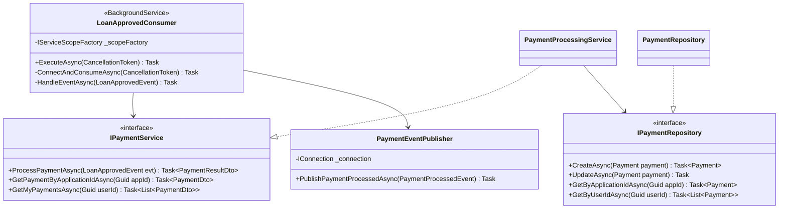
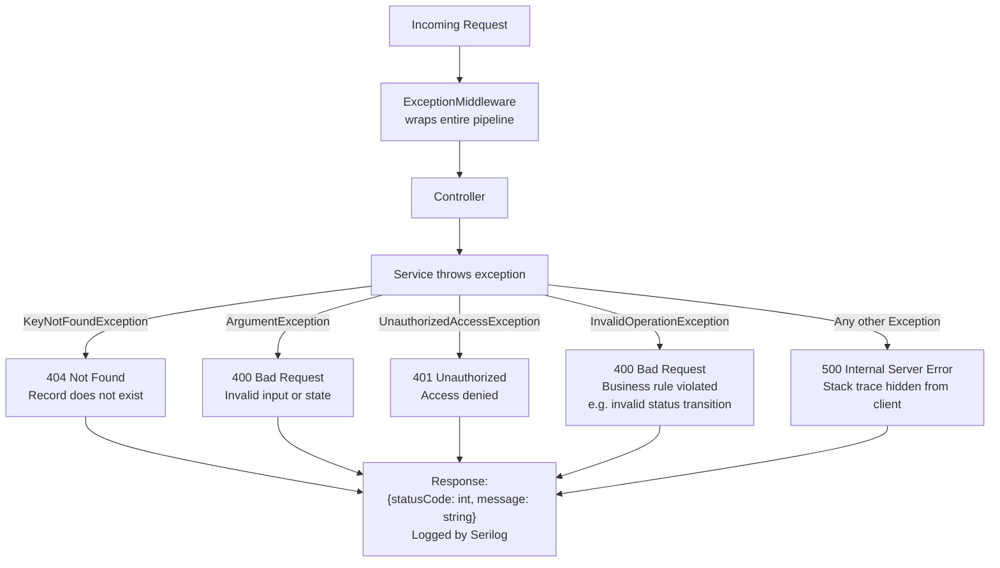

# CapFinLoan — Low Level Design (LLD)

## Overview

This document describes the internal design of each microservice — the layered architecture pattern,
all domain models with fields, service interfaces, repository interfaces, and the loan status state machine.

---

## 1. Layered Architecture Pattern (applied in all 6 services)

---

## 2. Domain Model — All Entities

---

## 3. Loan Status State Machine

---

## 4. Service Interfaces (all services)

### AuthService

### ApplicationService

### DocumentService

### AdminService

### PaymentService

---

## 5. SharedKernel Contents

```mermaid
classDiagram
    class ApiResponseDto {
        +bool Success
        +string Message
        +T Data
        +List~string~ Errors
        +SuccessResponse(T data, string msg)$ ApiResponseDto
        +FailResponse(string msg, List errors)$ ApiResponseDto
        +FailResponse(string msg)$ ApiResponseDto
    }

    class PagedResponseDto {
        +List~T~ Items
        +int TotalCount
        +int Page
        +int PageSize
        +int TotalPages
        +bool HasPreviousPage
        +bool HasNextPage
    }

    class ApplicationStatus {
        <<enumeration>>
        Draft
        Submitted
        DocsPending
        DocsVerified
        UnderReview
        Approved
        Rejected
        Closed
    }

    class LoanType {
        <<enumeration>>
        Personal
        Home
        Vehicle
        Education
        Business
    }

    class DocumentType {
        <<enumeration>>
        AadhaarCard
        PAN
        Passport
        SalarySlip
        BankStatement
        ITReturn
        UtilityBill
        Other
    }

    class DecisionType {
        <<enumeration>>
        Approved
        Rejected
    }

    class LoanStatusChangedEvent {
        +Guid EventId
        +Guid ApplicationId
        +Guid UserId
        +string Email
        +string ApplicantName
        +string OldStatus
        +string NewStatus
        +string Remarks
        +DateTime Timestamp
    }

    class LoanApprovedEvent {
        +Guid EventId
        +Guid ApplicationId
        +Guid UserId
        +string ApplicantEmail
        +string ApplicantName
        +decimal LoanAmountApproved
        +decimal InterestRate
        +int TenureMonths
        +decimal MonthlyEmi
        +string ApprovedBy
        +DateTime Timestamp
    }

    class PaymentProcessedEvent {
        +Guid EventId
        +Guid PaymentId
        +Guid ApplicationId
        +Guid UserId
        +bool Success
        +decimal AmountDisbursed
        +string Message
        +DateTime Timestamp
    }

    class PaginationHelper {
        <<static>>
        +CreatePagedResponse(List items, int total, int page, int size)$ PagedResponseDto
    }
```

---

## 6. Exception Handling Flow (in all services)

---

## 7. RabbitMQ Event Architecture

| Event | Published By | Queue | Consumed By | Action |
|---|---|---|---|---|
| `LoanStatusChangedEvent` | ApplicationService | `loan.status.changed` | NotificationService | Send status email to applicant |
| `LoanApprovedEvent` | ApplicationService | `loan.approved` | PaymentService | Initiate loan disbursement |
| `PaymentProcessedEvent` | PaymentService | `payment.processed` | ApplicationService | Close loan (success) or revert to UnderReview (failure) |

**Pattern:** Consumer-owns-queue. Publisher declares exchange only. Consumer declares queue + binding + dead-letter args.

**Exchange:** `capfinloan.events` — Direct type, durable.

**Resilience:** BackgroundService consumers auto-reconnect with 10s retry on disconnect. Manual ack/nack. Failed messages → dead-letter queue (no message loss).
